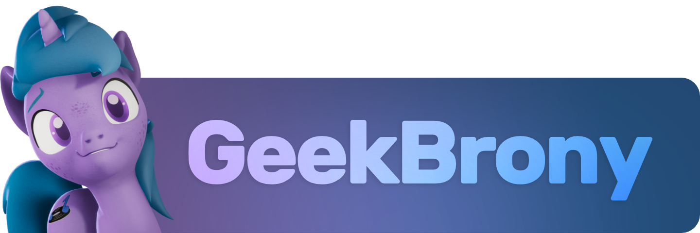

<!-- # GeekBrony 🦄 -->
- 💜 Pronouns: **they/them**
- 🎮 Unity Game Developer
- 💾 Software Engineer
- 🌐 Network Engineer (AAS)
- 🦄 3D Artist

## Skills / Experience
- 6 years - Unity Engine
- 6 years - C# (.Net / .Net Core) 
- 3 years - PHP
- 3 years - SQL / Database Design
- 2 years - Java

#### I'm currently learning...
- Unity
	- Tools Development
	- DOTS / ECS
- C# / .NET
	- EF Core
	- ASP.NET
	- Linq To Entities

## Current Project: PoniGame
Since 2018, I have been developing PoniGame, an MMO with cute pastel ponies.

More info:
- [PoniGame: 4 Years of Dev Progress (2018-2021)](https://www.youtube.com/watch?v=zJy9Oajqwn8)
- [@PoniGame on Twitter](https://twitter.com/PoniGame) - follow for announcements, updates and such
- [@PoniGame on Mastodon](https://pony.social/@PoniGame) - follow for announcements, updates and such

<!--

- 3 years of experience in 3D software (I main Blender and Substance Painter)

### About Me
- I am a musician!
	- I compose and produce music every once in a while.
	- I have performed as a DJ at several conventions!

-->
