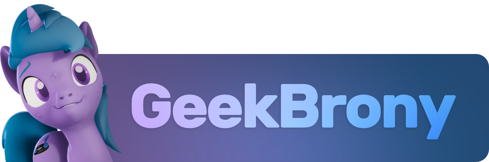

    	

# MoonbowPony / GeekBrony 🦄
- 💜 Pronouns: **she/her**
- 🎮 Unity Game Developer
- 💾 Software Engineer
- 🌐 Network Engineer (AAS)
- 🦄 3D Artist

## Skills / Experience
- 8 years - Unity Engine
- 8 years - C# (.NET / .NET Core)
- 5 years - SQL / Database Design
- 2 years - C / C++
- 2 years - Java

#### 📚 Currently learning...
- Unity Engine
	- Tools Development
	- Game Development
- .NET Core
	- Entity Framework Core
	- ASP.NET Core

## Current Project: PoniGame
In 2018, I started development on PoniGame, an MMO Sandbox with pastel ponies.

This is a personal project that I have been passionately + diligently working on as a way to learn and understand the software development lifecycle in games.
In the future, I plan to use this knowledge as a stepping stone for my career as a Software Engineer.
