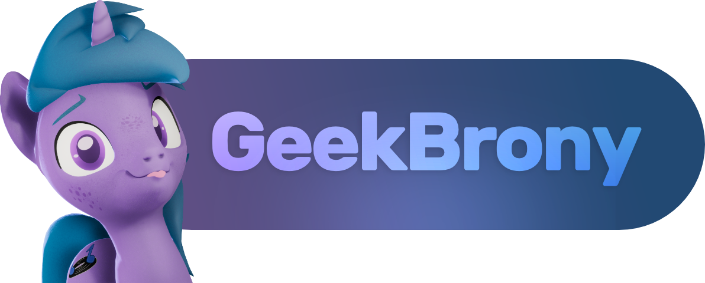

    	

# GeekBrony 🦄
- 💜 Pronouns: **she/her**
- 🎮 Unity Game Developer
- 💾 Software Engineer
- 🌐 Network Engineer (AAS)
- 🦄 3D Artist

## Skills / Experience
- 6 years - Unity Engine
- 6 years - C# (.NET / .NET Core)
- 3 years - PHP
- 3 years - SQL / Database Design
- 2 years - Java

#### 📚 Currently learning...
- .NET Core
	- Entity Framework Core
	- ASP.NET Core
- Unity Engine
	- Tools Development
	- Game Development
- C and C++
	- OpenGL (GLFW / GLEW)

## Current Project: PoniGame
In 2018, I started development on PoniGame, an MMO Sandbox with pastel ponies.

This is a personal project that I have been passionately + diligently working on as a way to learn and understand the software development lifecycle in games.
In the future, I plan to use this knowledge as a stepping stone for my career as a Software Engineer.

As a Backend Developer, I am responsible for:
- Developing the game's backend service architecture to scale.
- Developing and maintaining a custom .NET network serialization framework.
- Designing a PostgreSQL database from scratch using Entity Framework Core (Code-First)
